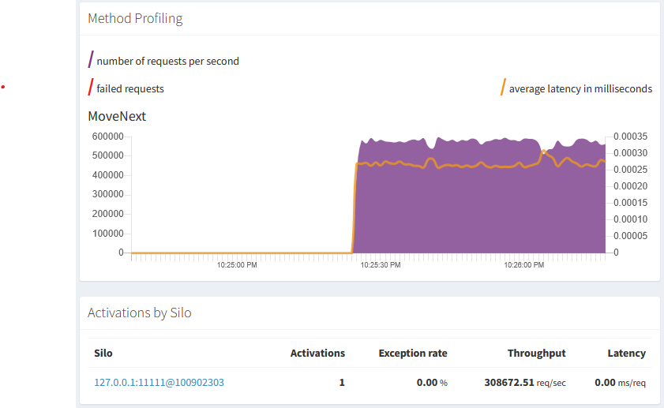

# OrleansAsyncEnumExceptionRepro

Small repro of issue present in Orleans 9.2.1 where caller never gets exception from a grain method returning IAsyncEnumerable,
leading the loop getting stuck.

**How to run:**

- `dotnet run`
- For counters `dotnet-counters monitor -n OrleansExceptionFromAsyncEnumerable -counters Microsoft.Orleans`
  - Or Orleans Dashboard: http://localhost:9999

We can observe on the calling side it never gets past the loop, no exception is thrown, 
and from counters or the Orleans Dashboard we can see that there are lots of MoveNext calls.

